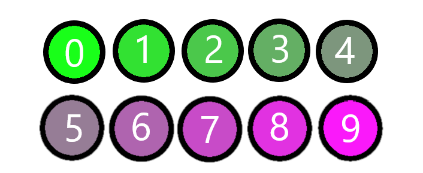
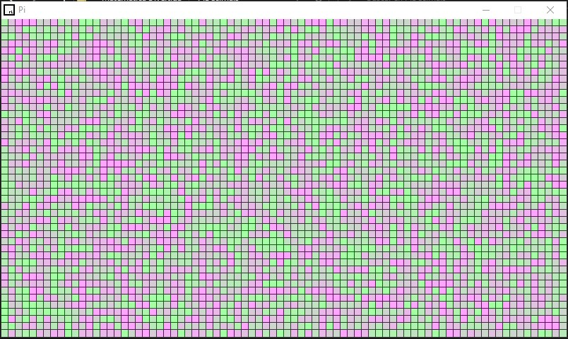

# PI DECIMALS

## Concepto
 Pidecimals es un ejercicio para pasar el rato libre jugando con las matemáticas y la programación. El algoritmo recrea en un rango de colores los digítos pertenecientes al enigmático número pi.

## Procedimiento
Para realizar el ejercicio, se puede valer de varios lenguages de programación o uno solo, en este caso se ha usado __C__ (para generar la vista con la librería [raylib](https://github.com/raysan5/raylib)) y __Java__ (para generar los 3600 decimales).

Se ha creado una regilla de 45 * 80 con cuadrados perfectos de 10px * 10px, con lo cual se rellenan con los colores pertinentes:

Donde:
Número    | Color
----------|----------
0         | (25,255,25)
1         | (50,225,50)
2         | (75,200,75)
3         | (100,175,100)
4         | (125,150,125)
5         | (150,125,150)
6         | (175,100,175)
7         | (200,75,200)
8         | (225,50,225)
9         | (250,25,250)

## Conclusión

El resultado final del experimento es un frame que se muestra a continuación.

Experimenta, juega, diviertete programando!